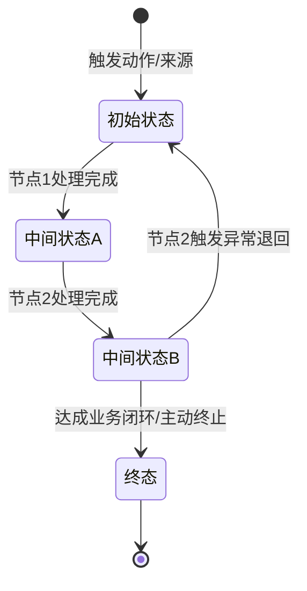
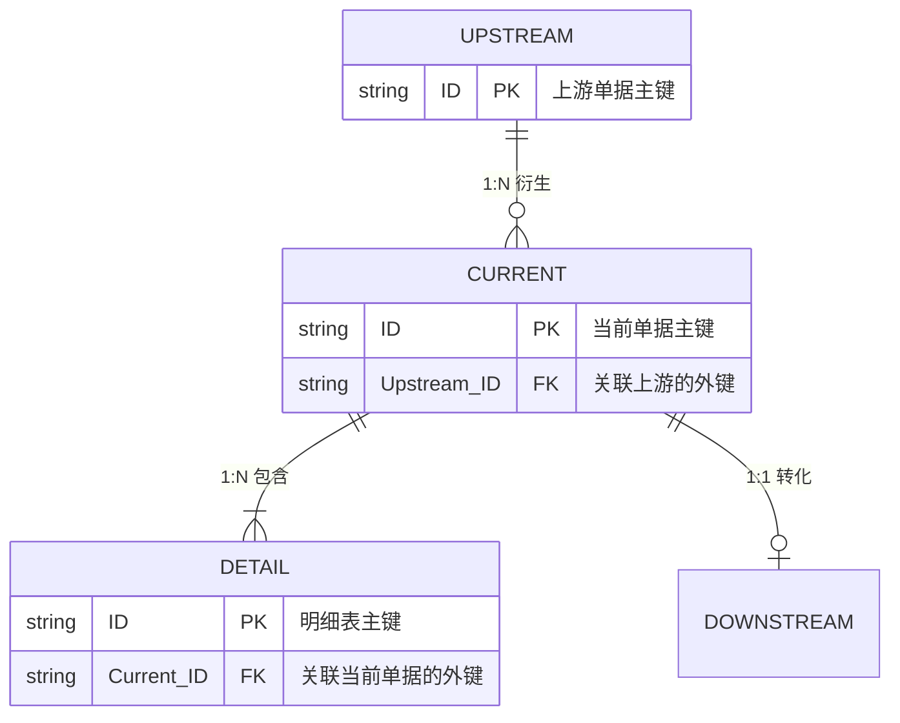
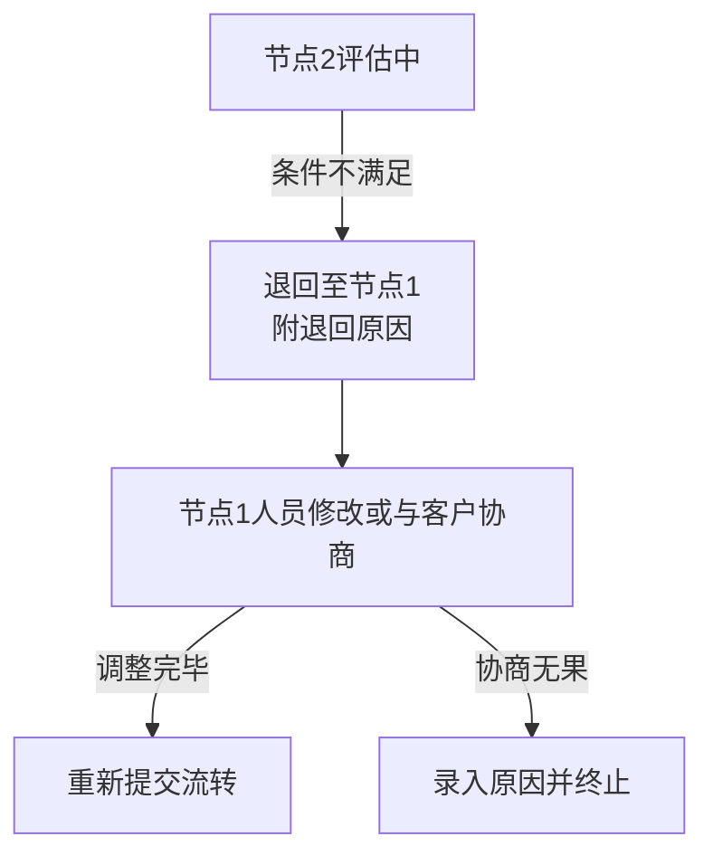

# [模块名称] 逻辑资产说明书

> **编写说明**：
> - 本模板将逻辑资产划分为 **[⭐ 必填项]**（核心骨架）与 **[💡 选填项]**（应对特定复杂场景）。
> - **切勿盲目照抄！** 若当前业务模块无特定场景（如：无动态审批、无外部系统交互），请 **保留** 对应的选填章节，并填写“无”。
---

## 1. 核心实体与状态机（⭐ 必填：研发/测试基座）

### 1.1 核心实体：[实体名称]

| 属性字段 | 说明 |
| :--- | :--- |
| [字段1：业务主键] | 例如：单号，系统自动生成，全局唯一 |
| [字段2：核心业务数据] | 例如：关联的主体对象、数量、金额等 |
| [字段3：状态控制字段] | 当前状态（见下方状态机） |
| [字段4：处理人追踪] | 当前待办责任人（支持转办追溯） |
| [字段5：审计时间戳] | 创建时间、最后更新时间（计算SLA） |
| [其他业务扩展字段] | ... |

#### 子实体：[子实体名称1]（如：明细行/附件/历史快照等）

> **说明**：若存在主子表关系，在此罗列各子实体的核心属性字段；若无子实体，删除此块。

| 属性字段 | 说明 |
| :--- | :--- |
| [子实体字段1] | 例如：关联父单据主键（外键） |
| [子实体字段2] | 例如：行号/序号，标识明细顺序 |
| [子实体字段3] | 例如：品名、规格、数量、单价等业务明细数据 |
| [其他扩展字段] | ... |

#### 子实体：[子实体名称2]（可按需增删）

| 属性字段 | 说明 |
| :--- | :--- |
| [子实体字段1] | 例如：关联父单据主键（外键） |
| [子实体字段2] | 例如：附件URL、文件名、上传人、上传时间 |
| [其他扩展字段] | ... |

### 1.2 核心枚举与数据字典（数据标准）

> **规则说明**：明确核心字段的枚举值定义，确保前后端与外部系统的数据标准一致。

| 枚举字段名 | 枚举值及释义 | 业务影响/控制逻辑 |
| :--- | :--- | :--- |
| **[某状态/类型]** | `10`-草稿；`20`-待审批；`30`-已完成 | 控制该单据是否允许特定操作 |
| **[业务来源]** | `APP`-移动端；`WEB`-网页端；`API`-外部接入 | 用于埋点统计不同渠道的业务转化率 |

### 1.3 [实体名称]生命周期状态机

> **状态约束说明**：
> - 描述哪些状态下允许做特定高危操作（如：终止、撤回、删除）。
> - 描述哪些角色在哪些状态下具有编辑权/只读权。
> - 明确终态的不可逆转性。

### 1.4 实体关联映射（E-R 关系）

> **规则说明**：明确本实体与上下游核心实体（以及主子表）之间的关联维度，指导底层表结构外键及级联操作设计。

* **关联约束说明**：
  * **创建约束**：如，必须存在状态为 `[特定状态]` 的 `[上游单据]`，才允许创建本实体。
  * **级联操作**：如，删除本实体时，必须 **同步物理删除** 其挂载的子表明细；若本实体已关联生成了 `[下游单据]`，则 **强制禁止删除/撤回**。

---

## 2. 业务核心规则集（⭐ 必填：三层解耦）

> **规则拆分说明**：为了防止单表过度膨胀，本模板将业务规则剥离为“流转”、“校验”、“计算”三层。前端同学重点看校验层做表单拦截；后端重点看计算层和流转层写引擎。注意：可见性规则统一在 **第4章 权限隔离矩阵** 中定义。

### 2.1 状态流转决策表（解决“能不能走到下一步”）

| 规则ID | 当前状态 | 操作角色 | 流转动作 | 前置阻断条件（若触发则拦截） | 目标状态 | 异常反馈提示 |
| :--- | :--- | :--- | :--- | :--- | :--- | :--- |
| **F1** | `[初始状态]` | `[角色A]` | 点击“提交” | 存在未通过的字段校验（见2.2节） | `[下一状态]` | “单据校验未通过，请检查红字提示” |
| **F2** | `[中间状态]` | `[角色B]` | 点击“审核通过”| 外部接口查询 `[某资质]` 失效 | `[驳回状态]` | “客户资质已失效，自动退回至发起人” |

### 2.2 核心字段校验规则（解决“填得对不对”）

> **说明**：仅罗列跨字段联动校验或强业务校验（基础必填/正则约束可直接写在 UI 原型或第 9 章交互说明中）。

| 字段名称 | 校验触发时机 | 校验规则/逻辑说明 | 错误提示内容 |
| :--- | :--- | :--- | :--- |
| **`[受控字段A]`** | 失去焦点 / 提交时 | `[业务约束]`，例如：选择的交期必须晚于（当前日期 + 最短生产周期） | “交期不合理，最少需 X 天” |
| **`[联动字段B]`** | 实时联动 | 若 `[控制字段C]` 选择了“是”，则本字段必填，且下拉框只能选择 `[特定枚举集合]` | “特定场景下必填此项” |

### 2.3 核心计算与派生规则（解决“数值怎么算”）

| 派生/计算字段 | 依赖源字段 | 计算公式 / 派生逻辑 | 触发重新计算的时机 |
| :--- | :--- | :--- | :--- |
| **`[核心计算结果]`** | `[字段A]`, `[字段B]` | 例如：含税总价 = `[单价]` × `[数量]` × `(1 + 动态税率)` | `[单价]` 或 `[数量]` 变更时实时重算 |
| **`[业务派生字段]`** | `[关联源单据]` | 例如：默认继承上游主体的 `[支付条款]`，若上游未填写则回退拉取 MDM 客户主数据中的默认值 | 单据初始化渲染时（只读拉取） |

---

## 3. 流程资产（⭐ 必填：至少提供黄金路径）

### 3.1 黄金路径（成功路径）

### 3.2 异议退回路径（异常恢复路径）

### 3.3 终止路径（终态）

---

## 4. 权限与数据隔离矩阵（💡 选填：涉及多租户/越权风险时）

> **租户与可见性原则**：严格遵守数据隔离，确保商业机密与隐私合规。

| 角色 | 行级数据范围（可见哪些单） | 列级数据权限（可见哪些字段） | 备注说明 |
| :--- | :--- | :--- | :--- |
| **[外部角色]** | 仅本账号创建的数据 | 全部字段 | 租户间绝对隔离 |
| **[内部角色A]** | 仅自己名下（或本部门内）的数据 | 全部字段 | 根据企业管理制度配置数据域 |
| **[内部角色B]** | 全量数据（或特定流转到的数据） | **脱敏**：屏蔽[敏感字段] | 防数据泄露/飞单 |

---

## 5. 消息通知与定时任务矩阵（💡 选填：涉及异步/消息触达时）

### 5.1 消息通知（Notification）

| 触发场景 | 接收人 | 触达渠道 | 消息模板核心内容 |
| :--- | :--- | :--- | :--- |
| [某状态变更/事件] | [接收角色] | 站内信 / APP Push / 短信 | “【系统通知】您有新的[单据]待处理，单号：[XXX]” |

### 5.2 后台定时任务（Cron Jobs）

| 任务名称 | 调度频率 | 业务逻辑说明 |
| :--- | :--- | :--- |
| **[外部数据同步]** | [如：每 30 分钟] | 从 [外部系统] 获取最新数据，供[某角色]评估使用 |
| **[待办超时转办/告警]** | [如：每小时] | 扫描“[特定]”状态，若停留超 [N] 天，触发转办/告警逻辑 |
| **[僵尸数据自动清理]** | [如：每天凌晨 2 点] | 扫描长时间停滞且无推进的数据，系统自动置为“[终态]” |

---

## 6. 外部系统依赖与接口边界（💡 选填：跨系统交互时）

| 依赖系统 | 接口场景 | 调用方向 | 处理机制（同步/异步） |
| :--- | :--- | :--- | :--- |
| **[外部系统A]** | 校验前置条件（如：资质/黑名单） | 本系统 -> A系统 | 实时同步，操作前拦截校验 |
| **[外部系统B]** | 获取主数据/基础字典 | 本系统 -> B系统 | 定时 T+1 同步本地缓存（或监听MQ） |

---

## 7. 异常与容灾处理清单（💡 选填：核心主链路强烈建议填写）

| 异常场景 | 触发条件 | 系统行为（自动补偿/降级） | 用户感知 | 人工干预方式 |
| :--- | :--- | :--- | :--- | :--- |
| **依赖接口调用超时** | 接口响应 > [N]s | 重试 [M] 次，失败后熔断，阻止流转 | 提示“系统繁忙，请稍后重试” | 查看日志，排查网络/下游服务 |
| **系统崩溃导致状态不一致** | 节点流转落库时服务中断 | 采用最终一致性/事务补偿 | 提示“操作结果待确认，请刷新” | 运维查看死信队列，手动触发补偿 |
| **高并发重复提交** | 短时间内多次点击提交 | 前端防抖，后端做幂等校验（基于Token或业务主键） | 提示“请勿重复提交” | 无需人工干预 |

---

## 8. 审批流与流转配置规则（💡 选填：仅限多级动态审批场景）

> **规则说明**：针对存在多级审批或动态指派的业务场景（如：报价单审批、合同审批），在此统一定义流转配置规则，供规则引擎或工作流引擎解析。若本模块无动态审批流，可忽略此章。

### 8.1 审批节点配置矩阵

| 审批层级/节点 | 触发条件 | 审批角色/岗位 | 审批方式 | 驳回逻辑 |
| :--- | :--- | :--- | :--- | :--- |
| **[一级审批节点]** | [如：金额 < 10万，或默认触发] | [如：部门主管] | 会签 / 或签 / 依次审批 | [如：直接退回至发起人] |
| **[二级审批节点]** | [如：金额 ≥ 10万] | [如：财务总监] | [如：或签] | [如：退回至上一节点] |
| **[兜底审批节点]** | [如：涉及特定高管关注项] | [如：CEO] | [如：依次审批] | [如：退回至发起人] |

### 8.2 动态指派规则

* **超时转办规则**：节点停留超过 `[X]` 小时，自动转办给 `[备选角色/上级主管]`。
* **同岗位跳过规则**：若上下两级审批人为同一人（如部门主管兼任财务总监），系统是否自动跳过二级审批？（是/否）。
* **自审批规则**：若发起人即为第一级审批人，是否默认通过？（是/否）。

---

## 9. 用户交互说明（⭐ 必填：前端开发依据）

> **原则**：本节只写“点击什么、跳转哪里、显示什么”，不掺杂业务判定规则（规则见第2章决策表）。
> **【强制规范】多端拆分要求**：如果业务涉及多端（如 APP 端、WEB 端、小程序端、WEB 管理端），**必须**在表格首列增加“终端类型”字段。若同一个操作节点在多端均支持，需明确标出“APP端/WEB端”；若某操作仅限特定端（例如只能在 APP 拍照上传，或只能在 WEB 管理端审核），必须将该节点拆分为独立行，禁止模糊泛化，以确保下游自动化生成 UI 页面清单时不会遗漏端侧专属页面。

| 终端类型 | 操作节点 | 角色 | 交互动作 | 页面/控件说明 | 反馈提示 |
| :--- | :--- | :--- | :--- | :--- | :--- |
| **APP端 / WEB端** | **[节点1-多端共有操作]** | [角色A] | 填写表单并点击“提交” | APP与WEB端均支持。必填项红色星号，[控件类型]说明 | 实时前端校验，非法字段高亮+提示 |
| **APP端** | **[节点2-APP专属交互]** | [角色A] | 拍照/选择附件 | 仅限APP操作。调取手机原生相机/相册 | 进度提示 |
| **WEB管理端** | **[节点3-后台审核/退回]** | [角色B] | 补充信息 + 点击“退回” | 仅限管理后台操作。弹出二次确认弹窗+必填原因文本框 | 退回成功后刷新列表，移出待办 |

---

## 附录：与旧版文档的对照映射（如适用）

| 原文档章节 | 新逻辑资产位置 |
| :--- | :--- |
| [旧版功能点1] | → 第2章决策表 R1 + 第9章交互说明 |
| [旧版功能点2] | → 第1章状态机 + 第3章流程图 |
