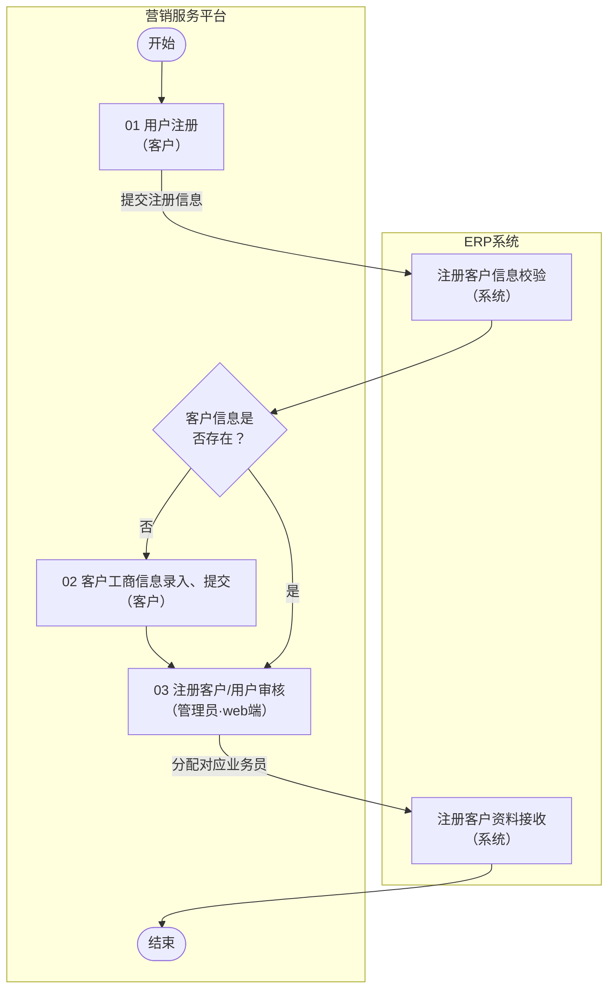
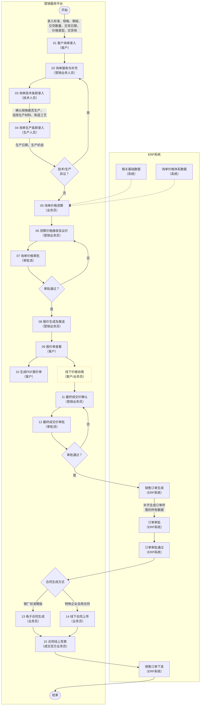

# 数字营销业务流程设计
## 用户注册流程
### 业务流程

> 流程编号与名称：数字营销-用户APP端注册流程

### 流程说明
【1、用户注册】：客户在 APP /WEB端注册页面，填写手机号、登录密码、企业名称、统一社会信用代码、联系方式等注册账号信息，提交注册申请；ERP 系统调取内部客户档案库，根据客户提交的企业名称、统一社会信用代码等关键字段，校验该客户工商主体/账号是否已在系统中存在。
【2、客户工商信息提交】：客户所在公司如果没在ERP系统进行登记，则跳转至工商资料录入补充页面，进行公司信息录入统一社会信用代码、营业执照照片、法人信息、经营地址、行业类型等资料并提交。
【3、注册客户、用户审核】：补充后的完整客户资料回传至营销服务平台，推送至管理员审核节点，管理员完成资料真实性、完整性人工审核。
公司资料在ERP系统中存在的，用户注册后，信息也被推送至管理员审核节点进行审核。
审核通过后，需对注册用户人工分配对应区域的营销业务人员。
审核、业务员分配完后，系统将全套客户注册档案同步推送至 ERP 系统。

## 询单管理流程
### 业务流程

> 流程编号与名称：数字营销-询单业务流程

### 流程说明
【1、客户询单录入】：采购客户在 APP/WEB端录入询单基础信息：产品标准、规格、钢级、采购数量、交货日期、价格类型、交货地等需求数据，系统自动记录采购客户所在公司，提交询单至营销服务平台。；
【2、询单接收与补充】：根据客户与营销业务员对应关系，营销业务员接收客户提交的原始询单，核对基础需求信息，并对其信息进行补充完善；补充完后则流转至技术人员节点；
对于因技术原因或生产交付日期不能满足被退回的询单，业务员可线下与客户进行协商，调整产品规格、交期等需求，重新走技术、生产条款录入流程，若与客户协商后，客户终止询价，业务员可对该询单录入终止原因后进行关闭；
【3、询单技术条款录入】：技术人员根据客户询单规格，校验产品规格可生产性，选定对应生产材料、制造工艺，录入全部技术工艺相关条款，完成后流转至生产人员节点；
【4、询单生产条款录入】：生产人员结合技术条款，匹配对应生产日期、生产机组，录入排产、生产约束相关条款；
【5、询单价格测算】：业务员结合 ERP 同步的成本、价格体系等数据，匹配客户询单产品规格、数量、交期、工艺，完成询单综合成本、报价金额测算，生成初步报价方案；
【6、测算价格接收及修改】：业务员核对测算出的初步报价，结合客户合作等级、订单体量调整议价，形成待审批正式报价；流转至价格审批节点；
【7、询单价格审批】：报价方案推送公司价格审批流程，审批驳回，流程回退至【06 测算价格接收及议价】，业务员重新调整报价后再次提交审批；审批通过，流转至【08 报价生成及下发】；
【8、报价生成及推送】：审批通过后，业务员将报价方案推送至对应客户。
【9、报价单查看】：客户登录APP端，查看业务员下发的线上报价单，获取完整报价明细；客户可发起线下协商；
【10、生成PDF报价单】：客户可在APP端生成标准格式的PDF报价单。
线下价格协商（非系统功能，由业务员线下完成）:客户查看报价后，双方线下沟通议价、调整成交价格，协商达成一致后，由业务员录入最终成交价格，流转至【11 最终成交价确认】；
【11、最终成交价确认】：业务员将线下协商后的最终成交价格录入系统，锁定成交方案，提交成交价格审批；
【12、 最终成交价审批】：最终成交价格推送审批流程，审批驳回：回退至【11 最终成交价确认】，业务员重新和客户洽谈价格后再次确认提交；审批通过：同步全套询单、成交数据至 ERP 系统；
【销售订单生成（ERP 节点）】：ERP 接收营销平台审批完成的成交数据，补齐生成销售订单所需全部业务字段，自动创建正式销售订单，推送订单审批；
【订单审批（ERP 节点）】：ERP 内部启动销售订单审批流程，审批通过后将销售订单信息推送营销服务平台，同步区分两种合同生成方式；
【13、电子合同生成】：标准客户，选用系统内置标准合同模板，自动带入询单、订单、成交价格信息，生成线上电子合同，推送双方线上签章；
【14、线下合同上传】：针对特殊客户，业务员线下根据客户合同格式进行合同定制并上传线下拟定盖章的合同文件；
【15、成交双方业务员线上签章】：电子合同生成后，供需双方业务员在线完成电子签章；线下上传合同，同样完成线上确认，合同流程闭环，推送签章完成状态至ERP；
【销售订单下发（ERP节点）】：合同签章完成后， ERP可将已审批生效及签章完成的销售订单下发至生产等下游执行环节。

# 4 功能设计

数字营销平台面向钢铁行业客户，覆盖从用户注册、询单报价、价格审批到合同签章的端到端数字化营销全流程。系统主要功能包括WEB应用、移动应用（APP）以及系统接口。

## 4.1 WEB应用

### 4.1.1 用户注册管理
用户注册管理旨在规范客户准入流程，实现客户从线上注册、资料补充到后台人工审核的全流程线上化，确保录入的工商资质信息真实有效，并与ERP系统建立客户档案关联。

#### 1 用户注册

**1、业务描述**

企业客户可通过移动端 APP、Web 管理端两类渠道进入注册页面，自主填写企业主体、账号身份、联络信息等注册资料并提交线上注册申请。系统对提交信息完成合法性、格式校验后自动生成唯一注册申请单，暂存待后台管理员审核，未通过审核前账号不具备系统登录及业务操作权限。

**2、适用用户**

客户

**3、功能点说明**

注册申请：客户在 APP/WEB 端注册页面，填写基础账号信息并提交注册申请。具体操作包括：填写手机号，获取并输入短信验证码完成手机号验证；设置登录密码；填写企业名称；填写统一社会信用代码；填写联系方式（联系人姓名、联系电话等）；

提交：注册申请，系统生成注册申请记录。

**4、约束及其他说明**

1）同一手机号当日获取验证码超上限，锁定 1 小时后可重试；
2）登录密码须满足系统安全策略（如长度不少于 8 位，须包含字母与数字组合等）；
3）统一社会信用代码须通过格式校验（18位字符，符合国家标准编码规则）；
4）手机号须唯一，同一手机号不可重复注册；
5）注册申请提交后，账号处于"待审核"状态，未通过审核前不具备系统登录及任何业务操作权限。

#### 2 客户信息校验

**1、业务描述**

系统在接收到客户注册申请后，自动调取 ERP 内部客户档案库，根据客户提交的企业名称、统一社会信用代码等关键字段进行匹配校验，判断该客户工商主体是否已在系统中存在，并据此引导后续不同的业务路径。

**2、适用用户**

系统（自动）

**3、功能点说明**

ERP 客户校验：系统自动调用 ERP 接口，传入企业名称、统一社会信用代码等关键字段；ERP 系统在内部客户档案库中进行匹配查询；

校验结果分流：返回校验结果——若客户工商主体/账号已存在，标记为"已有客户"，直接进入注册审核流程；若不存在，标记为"新客户"，系统自动引导客户跳转至工商信息录入页面。

**4、约束及其他说明**

1）校验接口调用超时或 ERP 系统不可用时，系统应记录异常日志并提示客户稍后重试；
2）校验匹配逻辑以统一社会信用代码为主键进行精确匹配，企业名称作为辅助校验字段；
3）校验过程对客户透明，无需客户额外操作。

#### 3 工商信息录入

**1、业务描述**

针对在 ERP 系统中尚未登记的新客户，系统自动引导其跳转至工商资料录入补充页面，要求客户完整录入企业营业执照、法人信息、经营地址、行业分类等工商资质材料并提交，系统完成资料完整性校验后将数据回传至营销服务平台，形成完整的客户档案以供后续审核。

**2、适用用户**

客户

**3、功能点说明**

工商资料录入：客户在工商资料录入页面完成以下信息的填写与上传——录入/确认统一社会信用代码；上传营业执照照片（支持拍照或从相册选择）；填写法人信息（法人姓名、法人身份证号等）；填写经营地址（省/市/区/详细地址）；选择行业类型（从系统预设行业分类中选择）；

资料提交：提交工商资料，系统完成资料完整性校验后回传至营销服务平台。

**4、约束及其他说明**

1）营业执照照片仅支持 JPG、PNG、PDF 格式，单张文件大小不超过 10MB；
2）所有必填字段未完整填写时，系统不允许提交并提示具体缺失项；
3）统一社会信用代码须与注册环节填写的一致，不可修改；
4）行业类型须从系统预设分类中选择，不支持自定义输入。

#### 4 注册审核

**1、业务描述**

客户提交注册申请（含工商补充资料）后，系统将完整资料推送至管理员审核节点。管理员在 Web 管理端对客户注册资料进行真实性、完整性人工审核，审核通过后需为该客户人工分配对应区域的营销业务人员，完成客户与业务员的绑定关系。

**2、适用用户**

管理员

**3、功能点说明**

审核操作：管理员在待审核列表中查看新提交的客户注册申请；逐项核对客户提交的企业名称、统一社会信用代码、营业执照照片、法人信息等资料的真实性与完整性；

审核通过：对审核通过的申请，执行"审核通过"操作；

审核驳回：对审核不通过的申请，录入驳回原因并退回客户补充修正；

业务员分配：审核通过后，从营销业务人员列表中，按区域为该客户人工分配对应的营销业务人员；系统记录审核结果与分配信息，触发后续客户资料同步。

**4、约束及其他说明**

1）审核驳回时必须录入驳回原因，否则无法执行驳回操作；
2）审核通过后必须完成业务员分配，方可触发后续客户资料同步流程；
3）同一注册申请被驳回后，客户可修改资料后重新提交，不限驳回次数；
4）审核操作记录需完整留存，支持后续追溯查询。

#### 5 客户资料同步

**1、业务描述**

审核通过且完成业务员分配后，系统自动将全套客户注册档案（含注册信息、工商资料、审核结果、分配业务员等）封装推送至 ERP 系统，ERP 端自动创建或更新客户台账，实现营销平台与 ERP 系统的客户主数据统一。

**2、适用用户**

系统（自动）

**3、功能点说明**

数据封装与推送：系统自动封装客户注册信息、工商资料、审核结果、分配业务员等全套档案数据；调用 ERP 数据同步接口，将档案数据推送至 ERP 系统；

同步确认：接收 ERP 系统返回的同步确认结果，更新客户状态为"已同步"。

异常处理：同步异常时记录失败日志并触发重试或人工干预提醒。

**4、约束及其他说明**

1）同步过程为异步处理，不阻塞管理员的审核操作流程；
2）同步失败后系统自动重试，重试次数达上限后转为人工干预处理；
3）同步成功后客户状态变更为"已同步"，该状态不可逆；
4）同步数据须与审核通过时的数据保持一致，不允许中途篡改。

### 4.1.2 询单管理
询单管理贯穿需求发起到技术、生产环节的可行性评估，保障客户原始需求能够准确无误地转化为满足排产要求的标准生产指标。

#### 1 客户询单录入

**1、业务描述**

采购客户通过 APP/WEB 端录入询单基础需求数据，包括产品标准、规格、钢级、采购数量、交货日期、价格类型、交货地等信息。系统自动关联客户所属公司信息，生成唯一询单编号并推送至营销服务平台，由对应区域的营销业务人员进行后续处理。

**2、适用用户**

客户

**3、功能点说明**

询单信息填写：客户登录 APP/WEB 端，进入询单录入页面，依次完成以下信息的选择或填写——选择/填写产品标准（如 API、GB/T 等标准体系）；填写产品规格（外径、壁厚、长度等）；选择钢级（如 J55、N80、P110 等）；录入采购数量（吨数或根数）；选择期望交货日期；选择价格类型（出厂价、到货价等）；填写交货地（省/市/区/详细地址）；

自动关联：系统自动关联当前登录账号所属公司信息；

提交询单：提交询单，系统生成询单编号并推送至营销服务平台。

**4、约束及其他说明**

1）客户须完成注册审核并处于"已同步"状态方可提交询单；
2）所有必填字段未完整填写时不允许提交；
3）采购数量须为正数，系统校验数值有效性；
4）期望交货日期不得早于当前日期加最短生产周期；
5）每条询单生成唯一询单编号，不可重复。

#### 2 询单接收与补充

**1、业务描述**

系统根据客户与营销业务员的对应关系，自动将客户提交的询单分发至对应业务员。业务员接收客户原始询单后，核对基础需求信息并从专业维度进行补充完善，完善后流转至技术人员进行可生产性评估。对于因技术/生产异议退回的询单，业务员可与客户线下协商调整后重新提交，若协商无果则转入终止流程。

**2、适用用户**

营销业务员

**3、功能点说明**

询单接收：系统根据客户与业务员的对应关系，自动将询单分发至对应业务员的待处理列表；

核对与补充：业务员打开询单详情，核对客户填写的基础需求信息（规格、数量、交期等）；补充完善专业维度信息（如具体执行标准细则、特殊技术要求、包装方式等）；

流转操作：确认补充完成后，执行"流转至技术人员"操作；

退回处理：接收因技术/生产异议退回的询单，查看退回原因，与客户线下沟通协商，调整产品规格、交期等参数后重新提交流转；若协商后客户不再调整，可转入询单终止管理流程。

**4、约束及其他说明**

1）业务员只能查看和处理分配给自己的询单；
2）询单补充后须经业务员确认方可流转，不支持自动流转；
3）退回的询单可反复修改重新提交，无次数限制；
4）业务员不可修改客户原始录入的核心需求字段（如公司名称），仅可补充专业维度信息。

#### 3 技术条款录入

**1、业务描述**

技术人员承接业务员流转的询单，根据客户询单中的产品规格需求，校验产品的实际可生产性，选定对应的生产材料和制造工艺，并录入完整的技术工艺相关约束条款。评估通过后流转至生产人员，若因技术原因无法满足则退回业务员并说明原因。

**2、适用用户**

技术人员

**3、功能点说明**

技术评估：技术人员在待处理列表中接收并查看询单规格需求；校验产品规格的实际可生产性（对照现有产品目录与生产能力）；

技术条款录入：选定对应的生产材料（钢坯材质、规格等）；选定制造工艺（热轧、冷拔、焊接等工艺路线）；录入技术工艺相关约束条款（热处理要求、检测标准、尺寸公差等）；

流转或退回：若技术评估通过，执行"流转至生产人员"操作；若因技术原因无法满足生产，选择"技术异议退回"并录入退回原因，系统将询单退回至业务员。

**4、约束及其他说明**

1）技术人员须基于现有产品目录与生产能力进行可生产性判定；
2）技术异议退回时必须录入退回原因，说明具体不可满足的技术因素；
3）技术条款一旦确认流转至生产人员后，不可由技术人员自行撤回修改；
4）技术条款录入内容须完整覆盖生产所需的全部工艺参数。

#### 4 生产条款录入

**1、业务描述**

生产人员接收经技术评估通过的询单，结合已录入的技术条款，匹配可用的生产日期和生产机组资源，录入排产计划和生产约束条款。生产条件满足则询单流转至价格测算环节，若现有产能无法满足则退回业务员并说明原因。

**2、适用用户**

生产人员

**3、功能点说明**

排产资源匹配：生产人员在待处理列表中接收并查看询单及技术条款信息；根据技术条款要求，匹配对应的可用生产日期；匹配适合的生产机组（产线、设备）；

生产条款录入：录入排产计划（计划开工日、完工日）；录入生产约束条款（最小批量、合并生产要求等）；

流转或退回：若生产条件满足，确认完成后询单流转至价格测算环节；若发现现有产能无法满足预定交期或其他生产条件，选择"生产异议退回"并录入退回原因，系统将询单退回至业务员。

**4、约束及其他说明**

1）排产日期须在现有产能日历范围内，不可超出设备可用时段；
2）生产异议退回时必须录入退回原因，说明具体不可满足的生产因素（如产能冲突、交期不足等）；
3）排产计划中的完工日应满足客户期望交货日期（含物流运输周期）；
4）最小批量要求须在生产约束条款中明确标注。

#### 5 询单终止管理

**1、业务描述**

对于因技术或生产异议退回且经业务员与客户线下协商后仍无法达成一致的询单，业务员可在系统中录入终止原因并执行询单关闭操作，系统将该询单状态标记为"已终止"并归档保存，不可再重新发起流转。

**2、适用用户**

营销业务员

**3、功能点说明**

终止确认：业务员查看因技术/生产异议退回的询单信息及退回原因；确认已与客户线下协商且客户决定终止询价；

终止操作：在系统中录入具体终止原因（如客户取消需求、技术无法实现、交期无法满足等）；执行"关闭询单"操作，系统将询单状态标记为"已终止"；

归档处理：终止记录归档，不可再重新发起流转。

**4、约束及其他说明**

1）终止操作不可逆，执行后该询单不可重新激活或再次流转；
2）必须录入终止原因方可执行关闭操作；
3）仅处于"异议退回"状态的询单可执行终止操作，正常流转中的询单不可直接终止；
4）已终止的询单仍保留完整记录，支持后续查询与统计分析。

### 4.1.3 报价管理
报价管理包含成本测算、议价磋商与线上审批全流程。通过对接 ERP 底层价格体系与审批流，形成多级管控体系，最终促成透明、规范的价格成交方案。

#### 1 询单价格测算

**1、业务描述**

经技术、生产条款确认完成的询单进入价格测算环节。业务员结合 ERP 系统同步的基础成本数据和价格体系数据，对询单产品进行综合成本核算与报价测算，系统通过算法自动生成初步报价方案（含成本构成与利润空间分析），等待业务员进一步审核与调整。

**2、适用用户**

营销业务员

**3、功能点说明**

数据准备：系统自动从 ERP 获取最新的基础成本数据、价格体系数据；

自动测算：业务员选择待测算的询单，系统自动匹配询单中的产品规格、采购数量、交期、工艺等参数；系统通过算法完成询单综合成本测算（原材料成本、加工费、运输费等）；系统根据成本测算结果自动生成建议报价金额；

结果查看：业务员查看初步报价方案明细（含成本构成与利润空间分析）；系统自动生成初步报价方案，等待业务员进一步审核与调整。

**4、约束及其他说明**

1）价格测算依赖 ERP 基础数据同步的实时性，若数据未及时同步，测算结果可能存在偏差；
2）测算结果为系统建议值，业务员可在后续议价环节进行调整；
3）同一询单可反复执行测算操作以获取最新价格；
4）测算过程中所引用的成本模型版本须记录留存，确保可追溯。

#### 2 测算价格接收及议价

**1、业务描述**

业务员接收系统测算得出的初步报价方案后，核对各项成本构成及报价金额的合理性，并根据客户合作等级、订单体量等商务因素进行议价调整，形成待审批的正式对外报价方案，提交至公司内部价格审批流程。

**2、适用用户**

营销业务员

**3、功能点说明**

报价核对：业务员接收并查看系统测算得出的初步报价方案；核对各项成本构成及报价金额的合理性；

议价调整：根据客户合作等级（如战略客户、普通客户等）调整价格策略；根据订单体量（大单优惠、批量折扣等）进行适当议价调整；

提交审批：修改最终对外报价金额，形成待审批的正式报价；提交报价至价格审批流程。

**4、约束及其他说明**

1）议价调整后的报价金额须在系统允许的调整幅度范围内；
2）调整后的利润率不得低于公司设定的最低利润率红线；
3）审批被驳回后，业务员需根据驳回意见重新调整报价后再次提交；
4）价格调整记录须完整保留，支持审计追溯。

#### 3 询单价格审批

**1、业务描述**

业务员提交的正式报价方案推送至公司内部价格审批流程，系统根据报价金额、利润率等条件自动匹配对应的审批流程与审批人。审批通过后解锁报价生成功能，审批驳回则退回业务员重新调整。

**2、适用用户**

审批人

**3、功能点说明**

审批匹配：系统根据报价金额、利润率等条件，自动匹配对应的审批流程与审批人；

审批操作：审批人在待审批列表中查看报价方案详情（询单信息、成本明细、报价金额、利润率等）；审批人执行"通过"或"驳回"操作；

审批结果处理：审批驳回——录入驳回意见，系统将报价退回至"测算价格接收及议价"环节，业务员根据驳回意见重新调整后再次提交；审批通过——系统解锁报价生成功能，报价状态更新为"已审批"。

**4、约束及其他说明**

1）审批驳回时必须录入驳回意见；
2）审批流程可能涉及多级审批，每级审批人须独立审批；
3）审批超时未处理时，系统应发送催办提醒；
4）审批通过后报价状态锁定为"已审批"，不可由业务员自行修改，需重新发起审批流程。

#### 4 报价生成及推送

**1、业务描述**

价格审批通过后，系统自动基于审批通过的价格方案生成包含完整报价信息的正式报价单，业务员预览确认后一键推送至对应客户的 APP/WEB 终端，系统记录推送时间并向客户发送消息通知。

**2、适用用户**

营销业务员

**3、功能点说明**

报价单生成：系统自动基于审批通过的价格方案生成正式报价单（含产品规格、数量、单价、总价、有效期等信息）；

预览确认：业务员预览报价单内容，确认无误；

推送操作：业务员选择推送方式，一键将报价方案推送至对应客户的 APP/WEB 终端；系统记录推送时间，并向客户发送消息通知。

**4、约束及其他说明**

1）仅审批状态为"已审批"的报价方案可生成正式报价单；
2）报价单须包含有效期，超过有效期的报价单自动标记为"已失效"；
3）推送后报价单内容不可修改，如需变更须重新走审批流程；
4）推送记录须完整保留，包含推送时间、推送对象等信息。

#### 5 报价单查看

**1、业务描述**

客户在 APP 端接收到报价推送通知后，登录系统查阅业务员推送的线上报价单，获取完整的报价明细信息，并可在线浏览历史报价进行对比。若客户对价格有异议，可发起线下协商。

**2、适用用户**

客户

**3、功能点说明**

通知接收：客户通过 APP 端接收到报价推送通知；

报价查看：客户登录后在报价单列表中查看最新报价；查阅报价单完整明细，包括产品规格、单价、总价、各项商务条款、报价有效期等；

历史对比：客户可在线浏览历史报价记录进行对比；

线下协商：客户若对价格有异议，可选择发起线下协商沟通。

**4、约束及其他说明**

1）客户仅可查看推送给本公司的报价单，不可查看其他客户的报价信息；
2）已失效的报价单仍可查看但须标注"已失效"状态；
3）客户不可在线直接修改报价内容，价格变更须通过线下协商由业务员操作。

#### 6 生成PDF报价单

**1、业务描述**

客户在查阅线上报价单后，可在 APP 端一键将报价信息按标准模板排版生成 PDF 格式的电子报价单，支持在线预览、本地下载以及通过微信、邮件等渠道分享。

**2、适用用户**

客户

**3、功能点说明**

PDF 生成：客户在报价单查看页面点击"生成PDF"按钮；系统将报价信息按标准模板排版，生成标准样式的 PDF 格式电子报价单；

预览与下载：客户可在线预览 PDF 报价单；支持下载 PDF 文件至本地存储；

分享：支持通过微信、邮件等渠道分享 PDF 报价单。

**4、约束及其他说明**

1）PDF 报价单样式统一使用系统标准模板，不支持自定义样式；
2）生成的 PDF 自动加盖系统水印，标注生成时间；
3）已失效的报价单生成的 PDF 须带有"已失效"水印标识。

#### 7 最终成交价确认

**1、业务描述**

客户查看报价后，若对价格有异议，双方通过线下协商议价、调整成交价格。协商达成一致后，由业务员将最终议定的成交价格录入系统，系统锁定成交方案并生成待审批记录，提交至最终成交价审批流程。

**2、适用用户**

营销业务员

**3、功能点说明**

成交价录入：业务员在对应询单/报价单中进入"成交价确认"功能；录入最终议定的成交价格（单价、总价）；录入成交备注信息（协商调整说明等）；

方案锁定：系统将成交金额与条款方案进行锁定，生成待审批的成交方案；

提交审批：业务员确认无误后，提交至最终成交价审批流程。

**4、约束及其他说明**

1）最终成交价须在公司允许的价格浮动范围内；
2）成交备注中须说明与原报价的差异原因；
3）审批被驳回后，业务员需重新与客户沟通并录入调整后的价格；
4）成交方案锁定后不可由业务员自行修改，须通过审批流程变更。

#### 8 最终成交价审批

**1、业务描述**

业务员提交的最终成交价格方案推入高层审批流程，系统根据成交金额匹配对应的高层审批人。审批通过后系统锁定最终销售价格，并将完整的询单需求数据与成交数据同步推送至 ERP 系统，触发销售订单生成流程。

**2、适用用户**

审批人

**3、功能点说明**

审批查看：系统根据成交金额匹配对应的高层审批人；审批人查看成交方案详情（原报价、最终成交价、调整幅度、利润分析等）；

审批操作：审批人执行"通过"或"驳回"操作；

审批结果处理：审批驳回——回退至"最终成交价确认"（4.3.7）环节，业务员需重新与客户沟通并录入调整后的成交价格后再行提交；审批通过——系统锁定最终销售价格，并将完整的询单需求数据与成交数据同步推送至 ERP 系统。

**4、约束及其他说明**

1）高层审批人根据成交金额分级匹配，大额成交须更高层级审批；
2）审批驳回时必须录入驳回意见；
3）审批通过后价格最终锁定，不可再修改；
4）数据推送至 ERP 失败时，系统应自动重试并记录异常日志。

### 4.1.4 合同管理
合同管理提供不同类型客户的差异化线上签约手段，实现从智能模板生单、审批签章到流程闭环。

#### 1 电子合同生成

**1、业务描述**

ERP 订单审批通过后，对于标准客户场景，系统自动调用内置的标准合同模板，将已审批通过的询单数据、订单信息及最终成交价格代入模板，自动生成线上电子合同文本，供业务员预览确认后推送供需双方发起线上签章。

**2、适用用户**

营销业务员、系统

**3、功能点说明**

合同生成触发：ERP 订单审批通过后，系统判定合同生成方式为"标准模版"；

模板调用与数据代入：系统调用内置的钢厂标准合同模板；自动将已审批通过的询单数据（规格、数量等）、订单信息（订单号、交货期等）及最终成交价格代入合同模板；

预览与确认：生成电子合同文本，供业务员预览确认；业务员确认合同内容无误后，系统推送给供需双方发起线上签章。

**4、约束及其他说明**

1）电子合同模板由系统统一维护，业务员不可自行修改模板内容；
2）合同数据自动代入后，业务员仅可进行预览确认，不可修改合同条款；
3）合同生成后须在规定有效期内完成签章，逾期需重新生成；
4）仅 ERP 订单审批通过且合同方式为"标准模版"时才触发本功能。

#### 2 线下合同上传

**1、业务描述**

针对使用特殊企业自用合同格式的客户，ERP 订单审批通过后，业务员在线下根据客户提供的合同模板拟定文本，双方完成线下纸质合同的协商、修改与盖章后，由业务员将已盖章的合同扫描件或照片上传至系统，进入线上确认流程。

**2、适用用户**

营销业务员

**3、功能点说明**

线下合同拟定：ERP 订单审批通过后，系统判定合同生成方式为"特殊企业自用合同"；业务员在线下根据客户提供的合同模板拟定文本；双方线下完成合同纸质版的协商、修改与盖章；

合同上传：业务员将已盖章的合同扫描件/照片上传至系统（支持 PDF、图片格式）；系统记录上传时间与文件信息，进入线上确认流程。

**4、约束及其他说明**

1）上传文件仅支持 PDF、JPG、PNG 格式，单个文件大小不超过 20MB；
2）上传的合同文件须清晰可辨识，系统不做 OCR 识别校验；
3）上传完成后进入线上确认流程，供双方在线备案确认；
4）仅合同方式为"特殊企业自用合同"时才使用本功能。

#### 3 合同线上签章

**1、业务描述**

合同生成或上传完成后，供需双方业务代表在线完成电子签章或线上确认操作。电子合同场景下双方完成电子印章签署，线下合同场景下双方在线查看已上传文件并点击确认完成备案。双方均完成后系统判定合同流程闭环，自动将签章完成状态回传至 ERP 系统，合同文件归档保存。

**2、适用用户**

营销业务员、客户

**3、功能点说明**

电子签章：电子合同场景——买卖双方业务代表在系统中在线完成安全的电子印章签署；

线上确认：线下合同场景——双方在系统中查看已上传的合同文件，分别点击"确认"完成线上备案；

流程闭环：双方均完成签章/确认后，系统判定合同流程闭环；

状态同步：系统自动将"合同已签章"完成状态回传推送至 ERP 系统；

归档保存：合同文件归档保存，支持后续查询与下载。

**4、约束及其他说明**

1）双方均须完成签章/确认操作，合同方可正式生效；
2）签章操作不可撤销，签章完成后合同内容不可修改；
3）签章完成状态须成功推送至 ERP 后方可触发后续订单下发；
4）合同归档后支持按询单编号、合同编号、客户名称等条件查询与下载。

### 4.1.5 消息管理

**1、业务描述**

系统提供统一的消息中心，用于接收、集中管理和处理来自系统各模块的通知、待办提醒和预警信息，包括价格议案审批提醒、最终成交价审批提醒、合同签章进度提醒、询单退回通知等，确保业务人员和审批领导能够及时获取关键业务进展并进行处理。

**2、适用用户**

全体系统用户

**3、功能点说明**

消息接收与分类：系统自动接收来自各业务模块触发的消息，并按类型（如待办任务、业务通知、系统预警等）进行聚合与分类展示；

消息提醒策略：支持多渠道提醒触达，包括站内信、弹窗提醒、以及可选的短信、邮件、APP推送等机制；

快捷处理跳转：用户点击具体消息，系统支持一键穿透跳转至关联的业务办理详情页（如直接进入审批单处理页面）；

消息状态管理：支持一键标记已读、消息标星关注、历史消息归档与查询等操作。

**4、约束及其他说明**

1）高优先级的待办消息需在用户登录首页显著位置强制提醒；
2）消息的生成应与底层业务节点状态变更强绑定，避免误报与漏报；
3）消息历史记录建议保留至少一年，以满足后续业务追溯需求。

### 4.1.6 审批流管理

**1、业务描述**

提供灵活、可视化的审批流程配置引擎，实现对数字营销平台内各项审批业务（如价格议案审批、最终成交价审批、特批业务等）的统一配置与管理。支持根据不同的业务规则、组织架构动态配置审批节点与流转条件，提升业务管控的灵活性。

**2、适用用户**

系统管理员

**3、功能点说明**

审批模型设计：可视化定义不同业务类型的审批流程图，设定触发条件（如基于报价金额、利润率动态决定分支走向）；

节点及参与者配置：配置各级审批节点，灵活指定审批参与者（可指定具体人员、岗位角色或基于汇报线的动态主管提取）；

流转规则配置：配置节点审批动作与规则（如单人签批、多人会签、多人或签），以及驳回策略（如退回发起人、退回上一节点等）；

流程监控与异常干预：管理员可全局监控运行中的审批实例状态，对于超时、节点人员离职等异常情况，支持强制转办、终止或跳过操作。

**4、约束及其他说明**

1）审批流配置的修改发布后，默认仅对新发起的业务实例生效，已在运行中的实例按原版本流程流转；
2）配置流转条件时需校验规则完整性，避免出现死循环或死胡同；
3）审批流程的每一次干预与调整操作均须留下详细的系统审计日志。

## 4.2 移动应用（APP）

移动应用端（APP）主要面向营销业务人员、采购客户及各级审批领导，提供随时随地的业务发起、跟进与审批能力，满足多场景下的高效处理需求。结合数字营销业务蓝图，移动端主要涵盖以下核心功能：

### 4.2.1 移动注册与认证
* **便捷用户注册与资料上传**
  客户可通过 APP 随时提交注册申请，支持调用手机摄像头快捷拍摄并上传营业执照照片等工商资料。
* **进度实时跟踪**
  实时查看注册审核进度与认证结果。

### 4.2.2 移动询单管理
* **随时随地询价**
  客户可随时通过 APP 发起询单，选择产品规格与交期。
* **询单跟进与补充**
  业务员可实时接收客户的询单提醒，并在移动端快速核对、补充基础信息，流转至技术人员。

### 4.2.3 移动报价与议价
* **报价推送提醒**
  客户可在 APP 实时接收业务员推送的报价单，支持在线查看明细、对比历史报价。
* **便捷PDF生成与分享**
  客户可一键生成 PDF 电子报价单，并通过移动端微信、邮件等渠道进行分享。
* **线下议价与成交录入**
  业务员可随时在 APP 录入与客户沟通后的最终成交价格并提交审批。

### 4.2.4 移动便捷审批
* **价格与成交审批**
  各级管理人员可通过 APP 随时随地处理价格与成交审批任务，查看报价明细与利润空间分析，快速执行“通过”或“驳回”操作。

### 4.2.5 移动合同与订单跟进
* **合同线上签章**
  买卖双方业务代表可在 APP 内完成安全的电子合同签署或线下合同的在线确认。
* **订单状态查看**
  合同签章完成后，业务员和客户可追踪销售订单在 ERP 端的下发与执行状态。

## 4.3 系统接口
在数字营销各关键节点与底层 ERP 保持强关联和实时数据通讯，打通企业前后端业务的数据孤岛。

### 4.3.1 客户档案同步

**1、业务描述**

客户档案同步作为营销平台与 ERP 系统之间的客户主数据通道，支持双向数据同步。注册校验方向由营销平台发起查询请求，ERP 返回客户是否存在的校验结果；资料回写方向由营销平台将审核通过的客户全套档案推送至 ERP，ERP 自动创建或更新客户台账。为 4.1.2（客户信息校验）与 4.1.5（客户资料同步）提供底层接口支撑。

**2、适用用户**

系统（自动）

**3、功能点说明**

注册校验同步：营销平台发起查询请求，ERP 返回客户是否存在的校验结果；

资料回写同步：营销平台将审核通过的客户全套档案推送至 ERP，ERP 自动创建或更新客户台账；

同步模式：支持增量同步与全量同步两种模式；

异常处理：同步异常时记录日志并触发告警通知。

**4、约束及其他说明**

1）同步接口须确保数据一致性，采用事务机制或幂等设计防止数据重复；
2）增量同步适用于日常运营，全量同步适用于系统初始化或异常恢复场景；
3）接口超时阈值须合理设定，超时后自动记录日志并触发告警；
4）同步日志须完整保留，支持故障排查与数据追溯。

### 4.3.2 基础数据同步

**1、业务描述**

ERP 系统维护的基础数据（产品主数据、成本模型数据）和价格体系数据（客户等级价格、区域价格策略等）定期同步至营销平台，确保营销平台的价格测算基础参数始终保持最新，为询单价格测算提供准确的数据支撑。

**2、适用用户**

系统（自动）

**3、功能点说明**

产品数据同步：定期同步 ERP 端维护的最新产品主数据（产品目录、规格参数等）；

成本数据同步：实时同步成本模型数据（原材料成本、加工费率等）；

价格体系同步：同步阶梯价格体系数据（客户等级价格、区域价格策略等）；

参数刷新：数据更新后自动刷新营销平台的价格测算基础参数；

同步触发：支持手动触发同步与自动定时同步。

**4、约束及其他说明**

1）定时同步频率须满足业务时效性要求，建议成本数据至少每日同步一次；
2）手动触发同步需管理员权限；
3）同步数据版本须记录，确保价格测算可追溯所用数据版本；
4）同步异常时不影响营销平台已有数据的使用，系统继续使用上一次成功同步的数据。

### 4.3.3 销售订单生成

**1、业务描述**

最终成交价审批通过后，ERP 系统接收数字营销平台推送的审批生效的询单与成交数据，自动补齐生成销售订单所需的内部业务字段（财务科目、供应链编码、税率等），在 ERP 系统内自动创建正式销售订单并触发内部订单审批流程，订单创建结果回传至营销平台。

**2、适用用户**

ERP系统（自动）

**3、功能点说明**

数据接收：接收数字营销平台推送的审批生效的询单与成交数据；

字段补齐：ERP 自动补齐生成销售单据所需的内部字段（财务科目、供应链编码、税率等）；

订单创建：在 ERP 系统内自动创建正式销售订单；

审批触发：同步触发 ERP 端内部订单审批流程；

结果回传：订单创建结果回传至营销平台，更新询单状态。

**4、约束及其他说明**

1）ERP 接收的数据须与营销平台审批通过的数据完全一致，不允许中途篡改；
2）订单创建失败时须将失败原因回传至营销平台，便于人工排查；
3）ERP 内部字段补齐须符合财务、供应链等各模块的业务规则校验；
4）订单创建成功后须分配唯一的 ERP 订单编号。

### 4.3.4 订单审批与下发

**1、业务描述**

ERP 内部启动销售订单审批流程，审批通过后将订单信息推送至营销平台触发合同生成流程。待营销平台合同签章完成并将签章完成状态推送回 ERP 后，ERP 确认销售订单正式生效，将已生效的订单指令下发至生产调度等下游执行环节，启动实质制造交付流程。

**2、适用用户**

ERP系统（自动）、ERP审批人

**3、功能点说明**

订单审批：ERP 内部启动销售订单审批流程，相关审批人完成审批操作；

合同触发：审批通过后，将订单信息推送至营销平台，触发合同生成流程；

签章状态接收：营销平台合同签章完成后，将"签章完成"状态推送回 ERP 系统；

订单生效：ERP 接收到签章完成状态后，确认销售订单正式生效；

订单下发：ERP 将已生效的订单指令下发至生产调度等下游执行环节，启动实质制造交付流程。

**4、约束及其他说明**

1）订单须同时满足"ERP 审批通过"和"合同签章完成"两个条件方可正式生效；
2）订单下发前须确认签章完成状态已成功接收，未接收到签章状态的订单不可下发；
3）订单下发后进入生产执行阶段，不可在营销平台端撤销；
4）订单审批与下发的全流程操作记录须完整保留，支持审计追溯。

